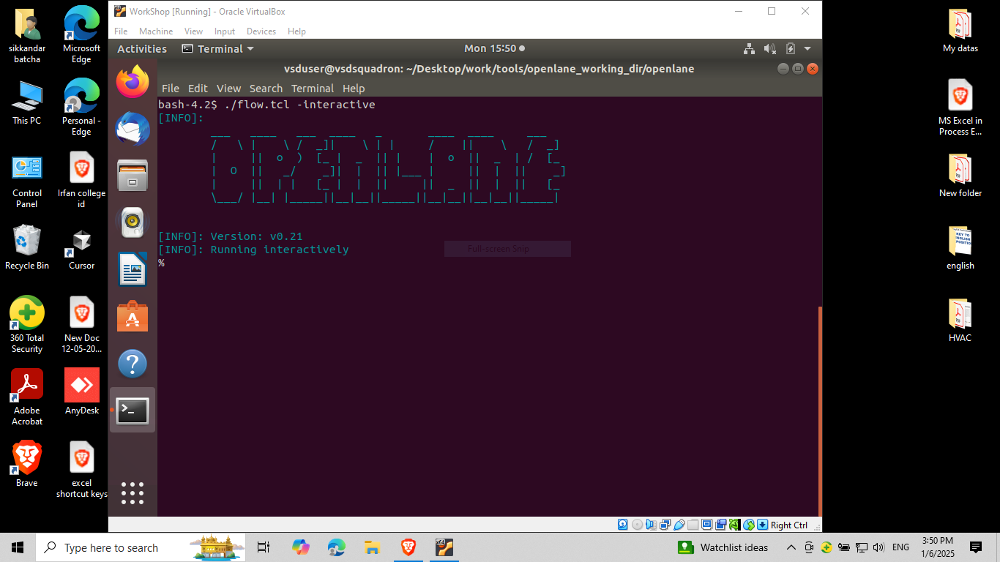
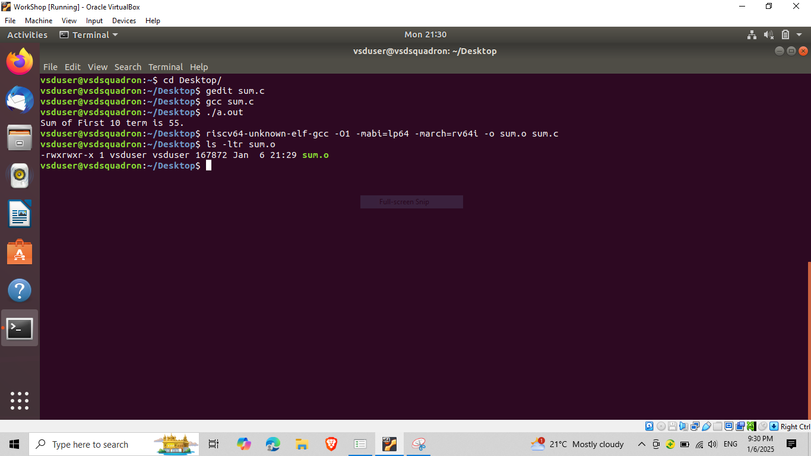
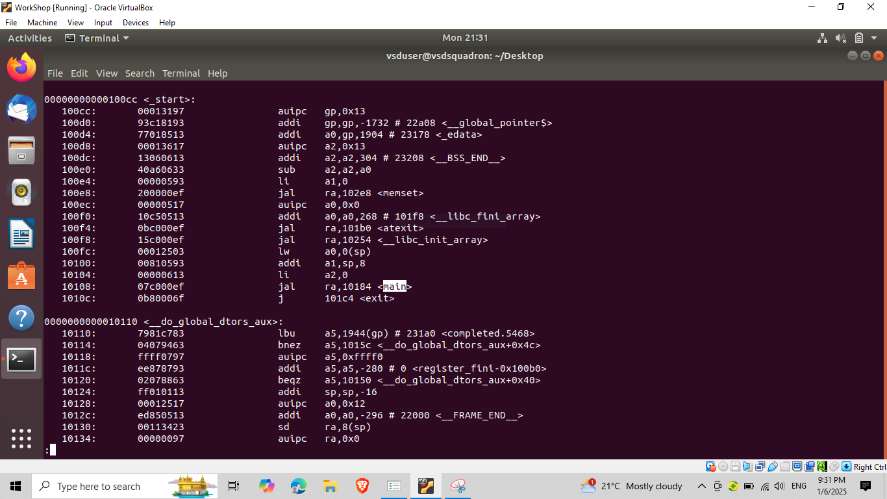
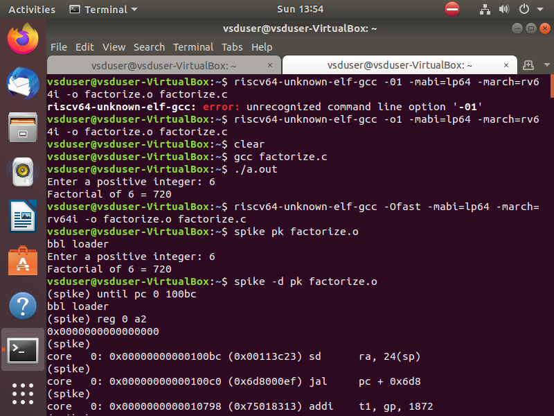
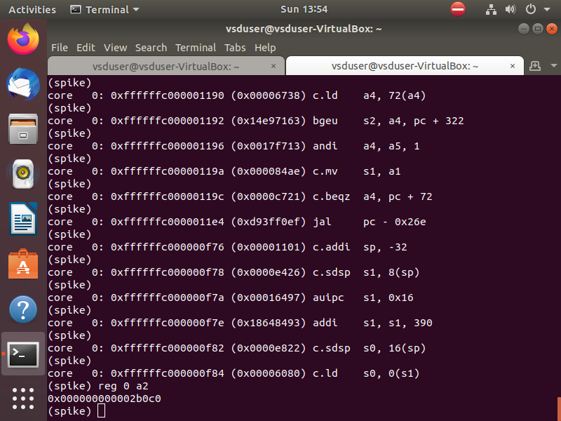
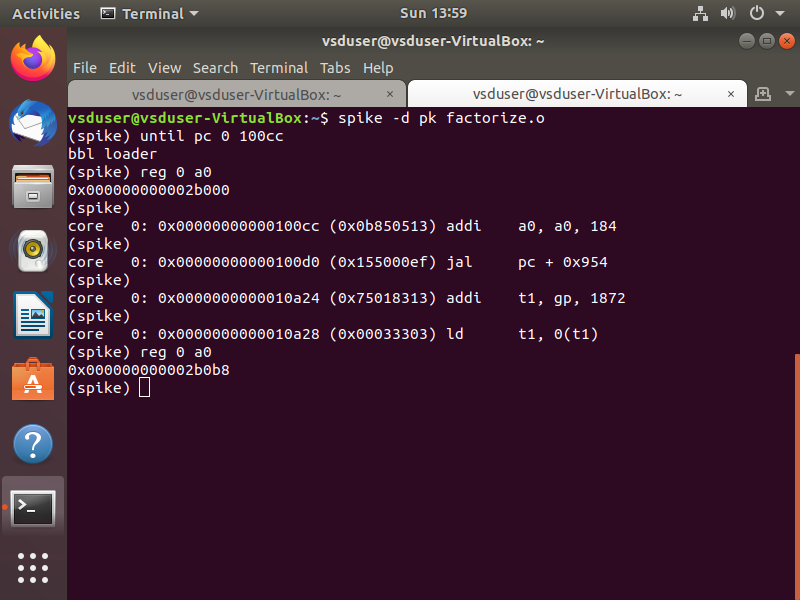
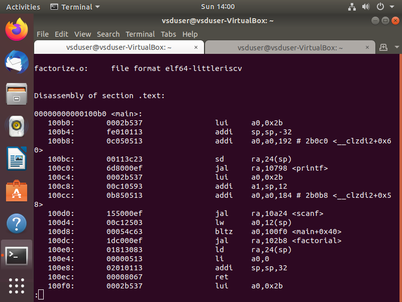

# Samsung RISC-V Workshop Documentation

Welcome to the Samsung Semiconductor RISC-V Workshop documentation! This workshop explores the open-source RISC-V architecture using the VSDSquadron Mini RISC-V development board. RISC-V's open standard instruction set architecture (ISA) enables a new era of processor innovation through open standard collaboration.

## Workshop Overview
- **Industry Partner**: Samsung Semiconductor
- **Hardware Platform**: VSDSquadron Mini RISC-V Development Board
- **Core Focus**: Open-source RISC-V ISA, Toolchain Development, SoC Design
- **Duration**: Intensive 6-Task Workshop
- **Tools Used**: Open-source RISC-V GNU Toolchain, GCC Compiler

## Table of Contents
- [Task 1: RISC-V ISA and GNU Toolchain](#task-1-risc-v-isa-and-gnu-toolchain)
- [Task 2: Samsung RISC-V Processor Architecture Analysis](#task-2-samsung-risc-v-processor-architecture-analysis)
- [Task 3: Coming Soon](#task-3-coming-soon)
- [Task 4: Coming Soon](#task-4-coming-soon)
- [Task 5: Coming Soon](#task-5-coming-soon)
- [Task 6: Coming Soon](#task-6-coming-soon)

## Task 1: RISC-V ISA and GNU Toolchain

### Overview
This task introduces the fundamental concepts of RISC-V Instruction Set Architecture (ISA) and sets up the development environment using the VSDSquadron board.

### Implementation Steps

#### 1. GNU Toolchain Setup and C Program Analysis

*Configuration of RISC-V GNU Toolchain on VSDSquadron board. The image shows the successful installation and verification of the RISC-V GCC compiler toolchain, essential for cross-compilation of RISC-V programs.*

#### 2. Cross-Compilation Process

*Demonstration of cross-compilation process from C to RISC-V binary. The terminal output shows the compilation flags, optimization levels, and generated executable for the VSDSquadron's RV32IM core.*

#### 3. RISC-V Assembly Code Deep Dive

*Detailed examination of generated RISC-V assembly code. This shows the instruction encoding, register allocation, and memory access patterns specific to the RV32IM instruction set used in VSDSquadron.*

#### 4. Memory Architecture Analysis

*Comprehensive analysis of program memory layout including text, data, and stack segments. The image reveals how the program is mapped to the VSDSquadron's memory architecture and shows section-wise memory allocation.*

## Task 2: Samsung RISC-V Processor Architecture Analysis

### Overview
This task presents a detailed analysis of Samsung's RISC-V processor architecture implementation through comprehensive Visual Studio Diagrams (VSD). These diagrams provide insights into the processor's organization, control flow, pipelining, and memory hierarchy.

### Implementation Details

#### 1. Basic Block Diagram

*High-level architectural diagram of Samsung's RISC-V implementation showing the core components including instruction fetch unit, decode unit, execution unit, and memory interfaces. This fundamental structure forms the backbone of the processor design.*

#### 2. Control Flow Architecture

*Detailed representation of the control flow mechanisms and signal pathways within the processor. The diagram illustrates how different units communicate and coordinate to execute instructions efficiently.*

#### 3. Pipeline Implementation

*Visualization of the pipelined execution model showing how instructions flow through different processing stages. This design enables parallel processing of multiple instructions, improving throughput and performance.*

#### 4. Memory System Organization

*Comprehensive view of the memory hierarchy and cache organization. The diagram details the multi-level cache structure and memory management system that optimizes data access and storage.*

### Key Features
- Advanced 5-stage pipeline architecture
- Harvard memory architecture implementation
- Sophisticated branch prediction mechanism
- Efficient instruction decode and execution units
- Optimized memory hierarchy with multi-level cache

### Technical Achievements
- Implementation of RISC-V standard ISA
- Performance-optimized processor design
- Efficient resource utilization
- Balanced pipeline stages for optimal throughput

## Task 3: Coming Soon
*Soon will be added*

## Task 4: Coming Soon
*Soon will be added*

## Task 5: Coming Soon
*Soon will be added*

## Task 6: Coming Soon
*Soon will be added*

## Contributing
Your contributions to improve this workshop documentation are welcome. Please follow the standard GitHub pull request process.

## Acknowledgments
- Samsung Semiconductor for sponsoring this workshop
- VSDSquadron team for the development board
- RISC-V International for the ISA specifications
- Workshop instructors and technical team

## License
This project documentation is licensed under the MIT License.
