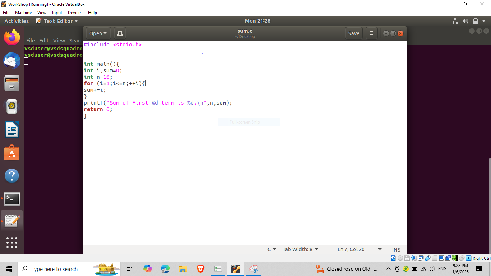

# Samsung RISC-V Workshop Documentation

Welcome to the Samsung Semiconductor RISC-V Workshop documentation! This workshop explores the open-source RISC-V architecture using the VSDSquadron Mini RISC-V development board. RISC-V's open standard instruction set architecture (ISA) enables a new era of processor innovation through open standard collaboration.

## Workshop Overview
- **Industry Partner**: Samsung Semiconductor
- **Hardware Platform**: VSDSquadron Mini RISC-V Development Board
- **Core Focus**: Open-source RISC-V ISA, Toolchain Development, SoC Design
- **Duration**: Intensive 6-Task Workshop
- **Tools Used**: Open-source RISC-V GNU Toolchain, GCC Compiler, Spike Simulator

## Table of Contents
- [Task 1: RISC-V ISA and GNU Toolchain](#task-1-risc-v-isa-and-gnu-toolchain)
- [Task 2: Coming Soon](#task-2-coming-soon)
- [Task 3: Coming Soon](#task-3-coming-soon)
- [Task 4: Coming Soon](#task-4-coming-soon)
- [Task 5: Coming Soon](#task-5-coming-soon)
- [Task 6: Coming Soon](#task-6-coming-soon)

## Task 1: RISC-V ISA and GNU Toolchain

### Overview
This task introduces the fundamental concepts of RISC-V Instruction Set Architecture (ISA) and sets up the development environment using the VSDSquadron board.

### Implementation Steps

#### 1. GNU Toolchain Setup and C Program Analysis

*Configuration of RISC-V GNU Toolchain on VSDSquadron board. The image shows the successful installation and verification of the RISC-V GCC compiler toolchain, essential for cross-compilation of RISC-V programs.*

#### 2. Cross-Compilation Process

*Demonstration of cross-compilation process from C to RISC-V binary. The terminal output shows the compilation flags, optimization levels, and generated executable for the VSDSquadron's RV32IM core.*

#### 3. RISC-V Assembly Code Deep Dive

*Detailed examination of generated RISC-V assembly code. This shows the instruction encoding, register allocation, and memory access patterns specific to the RV32IM instruction set used in VSDSquadron.*

#### 4. Memory Architecture Analysis

*Comprehensive analysis of program memory layout including text, data, and stack segments. The image reveals how the program is mapped to the VSDSquadron's memory architecture and shows section-wise memory allocation.*

## Task 2: Coming Soon
*Soon will be added*

## Task 3: Coming Soon
*Soon will be added*

## Task 4: Coming Soon
*Soon will be added*

## Task 5: Coming Soon
*Soon will be added*

## Task 6: Coming Soon
*Soon will be added*

## Contributing
Your contributions to improve this workshop documentation are welcome. Please follow the standard GitHub pull request process.

## Acknowledgments
- Samsung Semiconductor for sponsoring this workshop
- VSDSquadron team for the development board
- RISC-V International for the ISA specifications
- Workshop instructors and technical team

## License
This project documentation is licensed under the MIT License - see the LICENSE file for details.
